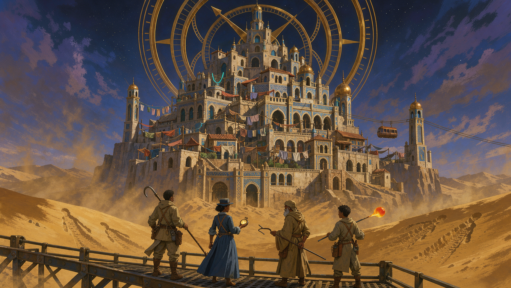
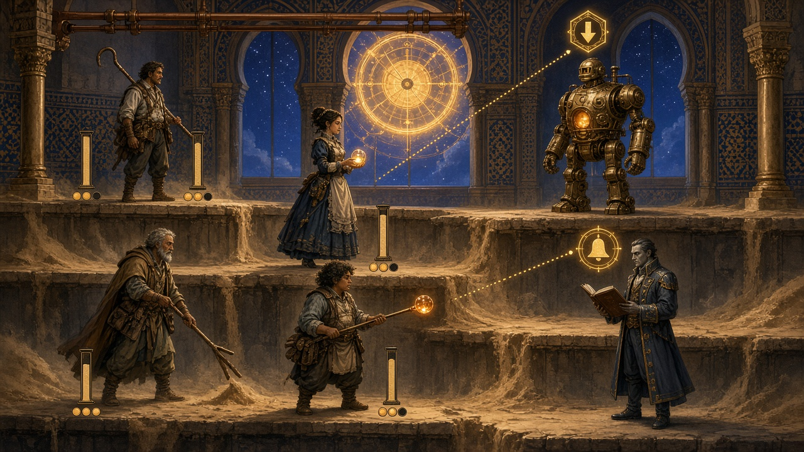

# 04 — Progression, économie, direction artistique, son

Concept B — « Le Sablier de Bab El », combat sans réflexes (`03-combat.md`).

## 1. Progression des personnages

- **Niveaux 1 → 60.** Courbe `xp(n) = 60 × n^1,6`. On arrive au boss de chaque
  étage au niveau prévu par le level design (±2) sans farmer.
- **Points de Palier** : 1 par niveau, dépensés dans **trois branches par
  personnage** (Salem : *Sonde* / *Corde* / *Carnet*). Réinitialisation
  gratuite à chaque palier de repos — l'expérimentation ne doit rien coûter.
- **Le Nom (3 segments)** est une progression parallèle : il ne se gagne pas en
  combattant, il se **retrouve** (quêtes, registres, creux). C'est la seule
  progression que le jeu peut aussi vous retirer.

## 2. Économie : le sable est la seule monnaie forte

Le sable a trois usages concurrents — c'est volontaire, c'est là que vit le
thème :

1. **Acheter une place sur la Liste.** Faire inscrire un PNJ (ou un compagnon)
   comme « prioritaire » pour l'évacuation suivante. Le prix monte à chaque
   cycle. C'est la décision la plus lourde du jeu : on paie avec ce qui tombe
   des combats, donc avec ce que les autres ont perdu.
2. **Forger et améliorer** les armes et les barrages de verre.
3. **Racheter un segment de Nom** — la puissance verrouillée.

Un joueur qui optimise le combat sacrifie les gens qu'il pourrait sauver. Un
joueur qui sauve tout le monde arrive aux boss sous-équipé. **Il n'y a pas de
bon choix, et c'est le sujet du jeu.**

Les **dinars** servent au courant (nourriture, tramway, pots-de-vin) ; ils ne
rachètent rien d'important.

## 3. Équipement (volontairement maigre)

| Emplacement | Quantité | Rôle |
| --- | --- | --- |
| Arme / outil | 1 | Définit le rôle et l'élément |
| Accessoire | 2 | Modificateurs (barrage +, sable +, hauteur +) |
| Registre | 1 | **Change une règle** (ex. : « la Récolte puise 60 sable au lieu de 40 ») |

Une vingtaine de pièces écrites à la main, chacune avec un nom, une phrase de
lore et un comportement distinct. Pas d'empilement d'armures.

## 4. Direction artistique

**Choix recommandé : 2D peinte « affiche » + personnages en sprites.**

- **La ville d'abord.** Bab El est le personnage principal : art déco
  mauresque, arcs outrepassés, zelliges géométriques, laiton et cuivre,
  tramways suspendus, néons calligraphiés, linge aux fenêtres. Chaque étage a
  sa palette — plus on monte, plus c'est clair et propre ; l'étage 4 est ocre
  et serré, l'étage 6 est blanc et vide.
- **Le sable est une couleur narrative.** Il n'est jamais gris : il est ocre
  doré en bas, beige poussiéreux au milieu, et presque blanc en haut — là où il
  n'arrive jamais.
- **L'Astrolabe** est toujours visible dans le ciel, même en intérieur (par une
  fenêtre, un reflet, une ombre portée). C'est le rappel permanent du compte à
  rebours.
- **Les personnages** : sprites haute densité, silhouette lisible, un vêtement
  de travail par personnage (le harnais du sondeur, le tablier de la
  souffleuse, la robe de bureau de l'horlogère). Pas d'armures de fantasy.
- **Les ennemis de la Chambre** portent tous le même gris administratif, avec
  un seul détail coloré : le ruban de leur registre. On doit pouvoir les
  reconnaître d'un coup d'œil.
- **UI** : formulaires, tampons, papier carbone, chiffres Orbitron pour rester
  dans l'identité du site Let's Play. Les barres de vie ressemblent à des
  colonnes de sable qui descendent.

**Alternative low-cost (celle du prototype actuel)** : tout en SVG/Canvas
vectoriel, ce qui permet de sortir le jeu **dans le navigateur** — c'est la
voie recommandée pour la version Let's Play.

**Ce qu'on évite** : la fantasy générique, le cyberpunk, et le steampunk
cuivré à l'européenne. Bab El est une ville du Maghreb : les motifs, les
couleurs et les écritures viennent de là.

### 4.1 Visuels retenus

Deux maquettes peintes fixent l'identité. Elles sont dans `docs/rpg/assets/`
(et déclinées en JPEG légers dans `public/` pour le site et la page de jeu).

**Key art** — `assets/sablier-keyart.png` : la ville de neuf étages sous
l'Astrolabe, le tramway suspendu, le linge aux fenêtres, et l'équipe vue de dos
sur la passerelle, face au sable qui monte. C'est l'image d'ouverture du jeu.

**Maquette de combat** — `assets/sablier-combat.png` : l'écran de combat tel
qu'on veut le *ressentir*. Trois étages en escalier, les vies en colonnes de
sable qui descendent, les PA en pastilles, et surtout **l'intention annoncée** :
au-dessus de chaque ennemi, un glyphe doré (⬍ lourd, 🔔 zone) et sa ligne de
visée pointillée vers sa cible. Le calme du tour par tour, la lisibilité
d'abord.

Ces deux images servent de référence pour tout asset futur : palette (ocre,
laiton, indigo), lumière (ambre de l'Astrolabe), et règle de lisibilité
(une information = un glyphe).

## 5. Son

- **Instruments** : oud, qanoun, bendir, derbouka, ney, plus un lit de
  synthétiseurs analogiques et beaucoup de **métal enregistré** (rails,
  ascenseurs, tampons, horloges) — la ville sonne comme elle est construite.
- **Thème principal — « Neuf Étages »** : une mélodie de 9 mesures, une par
  étage. Chaque chapitre en retire une.
- **Thème de Mahieddine** : le même thème joué **au métronome**, sans
  rubato. Il est littéralement incapable de jouer autrement.
- **Combat ordinaire** : percussions seules ; les cordes entrent quand la
  Consonance se déclenche, et tout s'arrête net quand l'Astrolabe sonne.
- **La sonnerie de l'Astrolabe** : un son unique, toujours le même, jamais
  mixé différemment. Après dix heures de jeu, le joueur doit le reconnaître
  avant de le voir.

## 6. Accessibilité

- Vitesses de combat réglables (×1 / ×2 / ×4) et **pilotage automatique**
  optionnel des tours.
- Aucune information ne passe par la couleur seule : chaque élément a une
  forme, chaque intention une icône et un mot.
- Taille de texte ×1,5 ; sous-titres complets.
- **Zéro contrainte de temps** par conception : le jeu est jouable en une
  main, dans un bus, et il attend le joueur indéfiniment. C'est un choix de
  design, pas une option.

## 7. Localisation

FR (langue d'écriture), EN, AR. L'arabe n'est pas une traduction mais une
**vraie version** : le jeu vient d'ici, les noms et les tournures locales
doivent survivre au passage. Un relecteur par langue, un glossaire de noms
propres verrouillé avant la première ligne de dialogue, et une attention
particulière aux termes administratifs (Liste, cycle, prioritaire) : ce sont
les mots les plus lourds du jeu.
